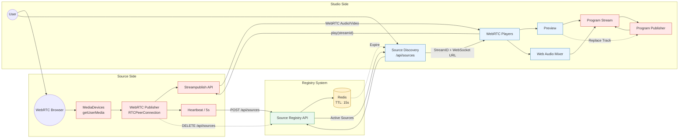
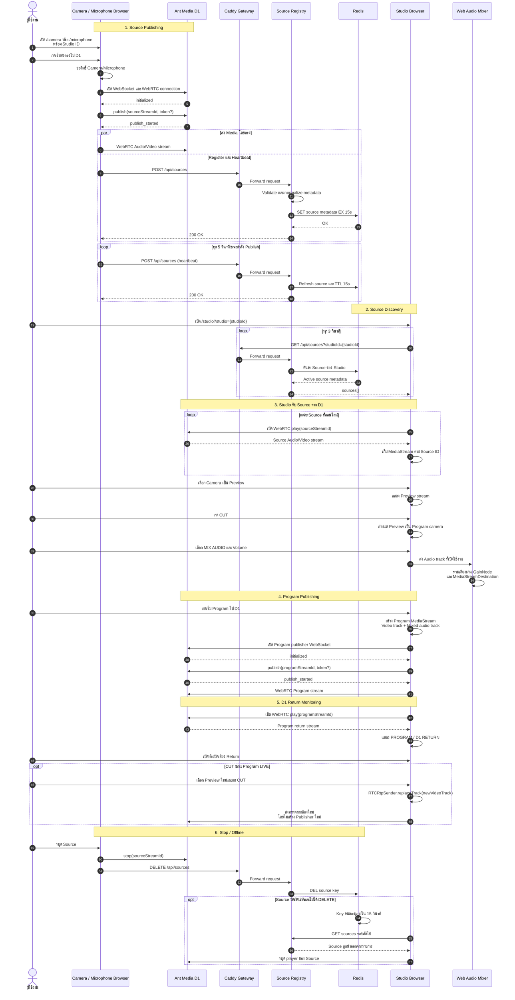

```mermaid
flowchart LR
    User([ผู้ใช้งาน])

    subgraph SourceSide["Source Browser"]
        SourcePage["Camera / Microphone Page"]
        Capture["MediaDevices<br/>Camera / Microphone"]
        Publisher["WebRTC Publisher"]
        Heartbeat["Registry Heartbeat<br/>ทุก 5 วินาที"]
    end

    subgraph Gateway["Application Gateway"]
        Caddy["Caddy<br/>HTTPS Gateway"]
    end

    subgraph RegistrySystem["Source Registry"]
        Registry["Go Source Registry API"]
        Redis[("Redis<br/>Source Metadata<br/>TTL 15 วินาที")]
    end

    subgraph AntMedia["Ant Media D1"]
        SourceStreams["Source Streams<br/>Camera / Microphone"]
        ProgramStream["Program Stream"]
    end

    subgraph StudioSide["Studio Browser"]
        Discovery["Source Discovery<br/>ทุก 3 วินาที"]
        Players["WebRTC Source Players"]
        Preview["Preview"]
        AudioMixer["Web Audio Mixer<br/>GainNode"]
        ProgramBuilder["Program MediaStream<br/>Video + Mixed Audio"]
        ProgramPublisher["WebRTC Program Publisher"]
        ReturnPlayer["D1 Return Player"]
        ProgramMonitor["Program Monitor"]
    end

    User -->|"เปิด Camera / Microphone"| SourcePage
    SourcePage --> Capture
    Capture --> Publisher

    Publisher ==>|"WebRTC Media โดยตรง"| SourceStreams
    Publisher -->|"publish_started"| Heartbeat

    Heartbeat -->|"POST /api/sources"| Caddy
    Caddy --> Registry
    Registry -->|"SET และต่อ TTL"| Redis

    User -->|"เปิด Studio"| Discovery
    Discovery -->|"GET /api/sources"| Caddy
    Redis --> Registry
    Registry -->|"Active Sources"| Caddy
    Caddy --> Discovery

    Discovery -->|"Stream ID + WebSocket URL"| Players
    Players ==>|"play(sourceStreamId)"| SourceStreams
    SourceStreams ==>|"WebRTC Audio / Video"| Players

    Players -->|"Camera Track"| Preview
    Players -->|"Audio Tracks ที่เลือก"| AudioMixer

    User -->|"เลือก Preview / CUT"| Preview
    Preview -->|"Selected Video Track"| ProgramBuilder
    AudioMixer -->|"Mixed Audio Track"| ProgramBuilder

    User -->|"เริ่ม Program"| ProgramPublisher
    ProgramBuilder --> ProgramPublisher
    ProgramPublisher ==>|"publish(programStreamId)"| ProgramStream

    ReturnPlayer ==>|"play(programStreamId)"| ProgramStream
    ProgramStream ==>|"D1 Return Stream"| ReturnPlayer
    ReturnPlayer --> ProgramMonitor

    User -->|"CUT ขณะ Live"| Preview
    Preview -.->|"RTCRtpSender.replaceTrack()"| ProgramPublisher

    User -->|"หยุด Source"| Publisher
    Publisher -->|"DELETE /api/sources"| Caddy
    Registry -->|"DEL Source"| Redis

    Redis -.->|"หมดอายุเมื่อไม่มี Heartbeat<br/>ภายใน 15 วินาที"| Discovery

    classDef browser fill:#e8f4ff,stroke:#2474a6,color:#123
    classDef media fill:#ffe8e8,stroke:#c0392b,color:#321
    classDef backend fill:#eaf8ee,stroke:#27864a,color:#132
    classDef storage fill:#fff2cc,stroke:#ad7d00,color:#321

    class SourcePage,Capture,Publisher,Heartbeat,Discovery,Players,Preview,AudioMixer,ProgramBuilder,ProgramPublisher,ReturnPlayer,ProgramMonitor browser
    class SourceStreams,ProgramStream media
    class Caddy,Registry backend
    class Redis storage
```

```mermaid
graph LR
    User((User))
    Browser((WebRTC Browser))

    User --> Browser

    subgraph SourceSide[Source Side]
        Browser --> S_Capture[MediaDevices<br/>getUserMedia]
        S_Capture --> S_Publisher[WebRTC Publisher<br/>RTCPeerConnection]
        S_Publisher --> S_Stream[Streampublish API]
        S_Publisher --> S_Heartbeat[Heartbeat / 5s]
    end

    subgraph RegistrySystem[Registry System]
        S_Heartbeat -->|POST /api/sources| Registry[Source Registry API]
        Registry --> Redis[(Redis<br/>TTL: 15s)]
    end

    subgraph StudioSide[Studio Side]
        User --> S_Discovery[Source Discovery<br/>/api/sources]
        S_Discovery --> Registry
        Registry -->|Active Sources| S_Discovery

        S_Discovery -->|StreamID + WebSocket URL| S_Players[WebRTC Players]
        S_Players -->|"play(streamId)"| S_Stream
        S_Stream -->|WebRTC Audio/Video| S_Players
        S_Players --> Preview[Preview]
        S_Players --> AudioMixer[Web Audio Mixer]
        AudioMixer --> P_Stream[Program Stream]
        Preview --> P_Stream

        P_Stream --> P_Publisher[Program Publisher]
        P_Publisher --> P_Stream
    end

    %% CUT Flow
    Preview -.->|Replace Track| P_Publisher

    %% Cleanup
    S_Publisher -.->|DELETE /api/sources| Registry

    %% TTL Expiry
    Redis -.->|Expire| S_Discovery

    style S_Capture fill:#ffe8e8,stroke:#c0392b
    style S_Publisher fill:#ffe8e8,stroke:#c0392b
    style S_Stream fill:#ffe8e8,stroke:#c0392b
    style S_Heartbeat fill:#ffe8e8,stroke:#c0392b
    style Registry fill:#eaf8ee,stroke:#27864a
    style S_Discovery fill:#e8f4ff,stroke:#2474a6
    style S_Players fill:#e8f4ff,stroke:#2474a6
    style Preview fill:#e8f4ff,stroke:#2474a6
    style AudioMixer fill:#e8f4ff,stroke:#2474a6
    style P_Stream fill:#ffe8e8,stroke:#c0392b
    style P_Publisher fill:#ffe8e8,stroke:#c0392b
    style Redis fill:#fff2cc,stroke:#ad7d00
```

```mermaid

sequenceDiagram
    autonumber

    actor Operator as ผู้ใช้งาน
    participant Source as Camera / Microphone Browser
    participant D1 as Ant Media D1
    participant Caddy as Caddy Gateway
    participant Registry as Source Registry
    participant Redis
    participant Studio as Studio Browser
    participant Mixer as Web Audio Mixer

    Note over Source,D1: 1. Source Publishing

    Operator->>Source: เปิด /camera หรือ /microphone<br/>พร้อม Studio ID
    Operator->>Source: กดเริ่มส่งตรงไป D1
    Source->>Source: ขอสิทธิ์ Camera/Microphone
    Source->>D1: เปิด WebSocket และ WebRTC connection
    D1-->>Source: initialized
    Source->>D1: publish(sourceStreamId, token?)
    D1-->>Source: publish_started

    par ส่ง Media โดยตรง
        Source->>D1: WebRTC Audio/Video stream
    and Register และ Heartbeat
        Source->>Caddy: POST /api/sources
        Caddy->>Registry: Forward request
        Registry->>Registry: Validate และ normalize metadata
        Registry->>Redis: SET source metadata EX 15s
        Redis-->>Registry: OK
        Registry-->>Source: 200 OK
    end

    loop ทุก 5 วินาที ขณะกำลัง Publish
        Source->>Caddy: POST /api/sources (heartbeat)
        Caddy->>Registry: Forward request
        Registry->>Redis: Refresh source และ TTL 15s
        Registry-->>Source: 200 OK
    end

    Note over Studio,Redis: 2. Source Discovery

    Operator->>Studio: เปิด /studio?studio={studioId}

    loop ทุก 3 วินาที
        Studio->>Caddy: GET /api/sources?studioId={studioId}
        Caddy->>Registry: Forward request
        Registry->>Redis: ค้นหา Source ของ Studio
        Redis-->>Registry: Active source metadata
        Registry-->>Studio: sources[]
    end

    Note over Studio,D1: 3. Studio รับ Source จาก D1

    loop แต่ละ Source ที่ออนไลน์
        Studio->>D1: เปิด WebRTC play(sourceStreamId)
        D1-->>Studio: Source Audio/Video stream
        Studio->>Studio: เก็บ MediaStream ตาม Source ID
    end

    Operator->>Studio: เลือก Camera เป็น Preview
    Studio->>Studio: แสดง Preview stream

    Operator->>Studio: กด CUT
    Studio->>Studio: กำหนด Preview เป็น Program camera

    Operator->>Studio: เลือก MIX AUDIO และ Volume
    Studio->>Mixer: ส่ง Audio track ที่เปิดใช้งาน
    Mixer->>Mixer: รวมเสียงผ่าน GainNode<br/>และ MediaStreamDestination

    Note over Studio,D1: 4. Program Publishing

    Operator->>Studio: กดเริ่ม Program ไป D1
    Studio->>Studio: สร้าง Program MediaStream<br/>Video track + Mixed audio track
    Studio->>D1: เปิด Program publisher WebSocket
    D1-->>Studio: initialized
    Studio->>D1: publish(programStreamId, token?)
    D1-->>Studio: publish_started
    Studio->>D1: WebRTC Program stream

    Note over Studio,D1: 5. D1 Return Monitoring

    Studio->>D1: เปิด WebRTC play(programStreamId)
    D1-->>Studio: Program return stream
    Studio->>Studio: แสดง PROGRAM / D1 RETURN
    Operator->>Studio: เปิดหรือปิดเสียง Return

    opt CUT ขณะ Program LIVE
        Operator->>Studio: เลือก Preview ใหม่และกด CUT
        Studio->>Studio: RTCRtpSender.replaceTrack(newVideoTrack)
        Studio->>D1: ส่งภาพจากกล้องใหม่<br/>โดยไม่สร้าง Publisher ใหม่
    end

    Note over Source,Redis: 6. Stop / Offline

    Operator->>Source: หยุด Source
    Source->>D1: stop(sourceStreamId)
    Source->>Caddy: DELETE /api/sources
    Caddy->>Registry: Forward request
    Registry->>Redis: DEL source key

    opt Source ปิดผิดปกติและไม่ได้ DELETE
        Redis->>Redis: Key หมดอายุภายใน 15 วินาที
        Studio->>Registry: GET sources รอบถัดไป
        Registry-->>Studio: Source ถูกนำออกจากรายการ
        Studio->>D1: หยุด player ของ Source
    end
```